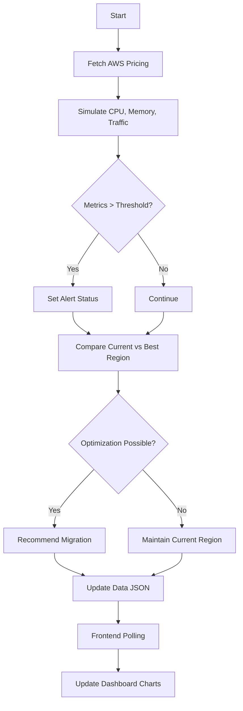

# Cloud Cost-Aware Deployment Dashboard - Project Report

## 1. Introduction
The **Cloud Cost-Aware Deployment Dashboard** is a real-time monitoring and optimization tool designed to assist DevOps teams and cloud architects in managing cloud infrastructure costs. In the era of cloud computing, dynamic resource allocation is key, but often leads to unpredictable billing. This project provides a simulated environment to visualize resource usage (CPU, Memory, Traffic) and recommends the most cost-effective AWS region for deployment based on current pricing and performance metrics.

## 2. Motivation
Cloud costs are a significant concern for organizations. Instances are often deployed in default regions without considering price variations across different geographical locations.
- **Cost Efficiency**: Prices for the same instance type (e.g., `t2.micro`) vary significantly between regions like `us-east-1` and `ap-south-1`.
- **Performance vs. Cost**: Balancing performance (low latency) with cost is challenging manually.
- **Automation**: There is a need for automated tools that not only monitor health but also proactively suggest cost-saving migrations.

## 3. Scope
This project is a **simulation-based prototype** intended to demonstrate the logic and feasibility of cost-aware deployment.
- **In Scope**:
    - Simulating server metrics (CPU, Memory, Traffic).
    - Fetching real-time or static AWS pricing for EC2 instances.
    - Calculating potential savings by migrating to cheaper regions.
    - interacting with a web-based dashboard for visualization.
- **Out of Scope**:
    - Actual migration of live production workloads (this is a decision support tool).
    - Monitoring of non-EC2 services (e.g., RDS, Lambda) in this version.

## 4. Key Features
- **Real-Time Monitoring**: Live tracking of system health metrics for multiple projects.
- **Cost Analysis**: Comparison of current hourly costs vs. optimal region costs.
- **Intelligent Recommendations**: Automated suggestions to migrate workloads when savings thresholds are met.
- **Predictive Analytics**: AI-simulated forecasting of future traffic and costs to prevent budget overruns.
- **Alerting System**: Visual alerts for critical events like high CPU load or projected cost spikes.

## 5. Architecture
The system follows a modular architecture separating data generation, analysis, and presentation.

### High-Level Architecture
1.  **Data Generator (Backend)**: A Python script (`cost_check.py`) that simulates server activity and fetches AWS pricing.
2.  **Data Store**: JSON files act as a lightweight, real-time data exchange layer.
3.  **Frontend Dashboard**: An HTML/JavaScript application that polls the data store and renders charts.
4.  **Deployment**: Docker containerization for consistent runtime environments.

### Tech Stack
- **Language**: Python 3.x (Backend Logic)
- **Libraries**: `boto3` (AWS SDK), `psutil` (System Monitoring), `json` (Data Handling)
- **Frontend**: HTML5, CSS3, JavaScript (Vanilla)
- **Visualization**: Chart.js (Interactive Graphs)
- **DevOps**: Docker, Bash Scripting, Git

## 6. Flowchart

## 7. Methodology
The project was developed using an iterative approach:
1.  **Requirement Analysis**: Identified key metrics needed for cost decisions.
2.  **Data Simulation**: Created Python scripts to mimic cloud server behavior, ensuring realistic variability.
3.  **Backend Logic**: implemented the comparison algorithm to find the cheapest region dynamically.
4.  **Frontend Development**: Built a responsive dashboard to visualize the JSON data streams.
5.  **Integration**: Connected the Python generator with the web UI via file-based data exchange.
6.  **Testing**: Verified alert triggers and cost calculations under various simulated load conditions.

## 8. Challenges
- **Real-Time Synchronization**: Ensuring the dashboard updates smoothly without locking the data files while the backend is writing to them.
- **AWS API Complexity**: Parsing the complex JSON response from the AWS Price List API to extract exact hourly rates.
- **Simulation Realism**: Tuning the random number generators to create "believable" traffic patterns rather than pure noise.

## 9. Limitations
- **Data Persistence**: Currently uses JSON files, which is not scalable for thousands of projects (a Database like PostgreSQL would be needed for scale).
- **Metric Simulation**: The metrics are simulated; in a production environment, this would need to hook into CloudWatch or Prometheus.
- **Single Instance Type**: The logic currently optimizes for a specific instance type (`t2.micro`).

## 10. Future Enhancements
- **Live Integration**: Replace simulation with actual CloudWatch metric streams.
- **Multi-Service Support**: Add support for RDS and S3 cost optimization.
- **Automated Migration**: Implement scripts that trigger actual AWS Lambda functions to move resources (Infrastructure as Code).
- **User Authentication**: Add login/logout functionality for multi-user access.

## 11. Conclusion
The Cloud Cost-Aware Deployment Dashboard successfully demonstrates how real-time data and pricing APIs can be combined to drive cost efficiency. By visualizing these metrics, organizations can move from reactive billing to proactive cost management.
